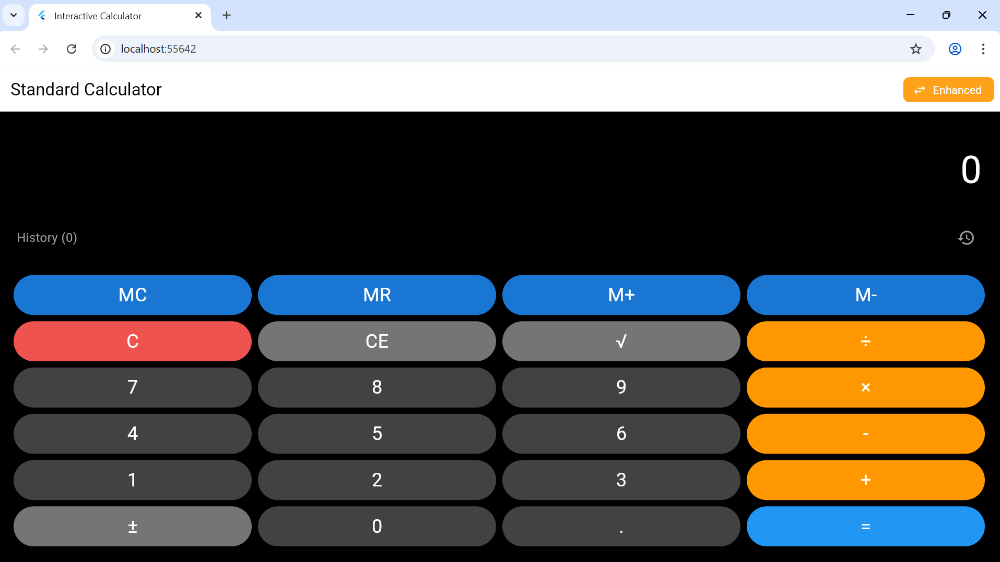
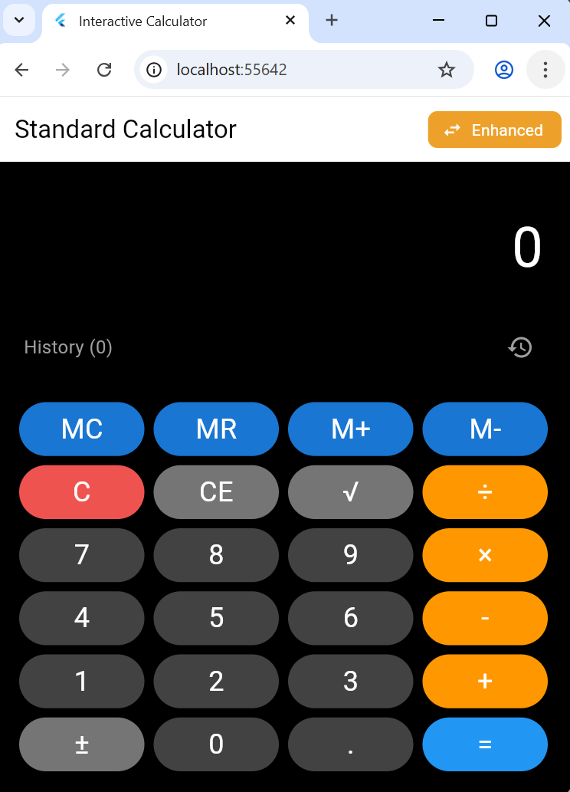
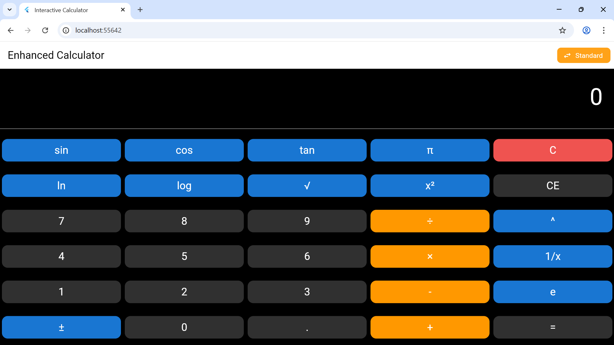
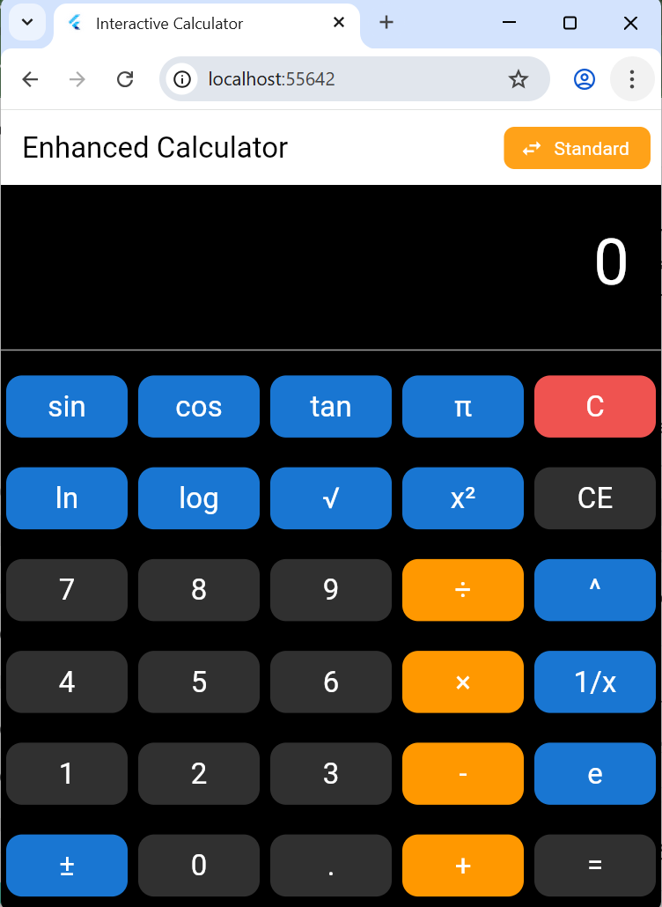

# interactive_caculator

A powerful, user-friendly calculator app built with **Flutter**. This app supports both **BASIC** and **Enhanced Scientific** calculations with a sleek and responsive user interface(UI). It's ideal for everyday arithmetic and more advanced scientific computations.

## 🚀 Features

- ✨ Clean, intuitive UI  
- 🧠 Basic arithmetic operations (+, −, ×, ÷)  
- 🔬 Scientific functions (sin, cos, tan, log, ln, √, ^, etc.)  
- 🕹️ Toggle between Standard and Scientific modes  
- 📜 Calculation history panel  
- 📱 Responsive layout for all screen sizes  

---

## 📸 Screenshots

| Standard 1 | Standard 2 |
|------------|------------|
|  |  |

| Enhanced 1 | Enhanced 2 |
|------------|------------|
|  |  |

---

## 🛠️ Getting Started

### Prerequisites

- Flutter SDK (latest stable version)
- Dart SDK
- IDE like VSCode or Android Studio

### Installation

1. **Clone the repository:**
   ```bash
   git clone https://github.com/Na-Tec/flutter-calculator-app.git
   cd flutter-calculator-app
````

2. **Install dependencies:**

   ```bash
   flutter pub get
   ```

3. **Run the app:**

   ```bash
   flutter run
   ```

---

Made with ❤️ by [Na-Tec](https://github.com/Na-Tec)

